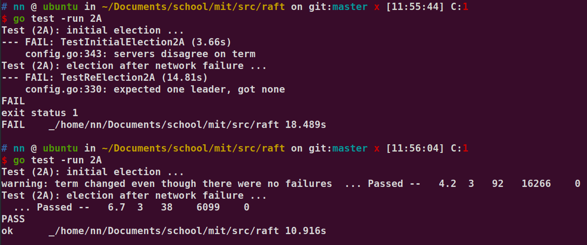

# Lab2a

这个小实验需要实现 raft 中的选举 master 和 心跳 的功能。

通过下面的指令进行测试结果。
```
go test -run 2A
```

## 目标

实现 raft leaeder election 以及 heartbeats。（心跳不需要带有 log entries）。

Hint 中提到，在现在这个阶段，我们只需要关心 
- RequestVote RPC
- Rules for servers 中与选举相关的部分
- 选举相关的状态机

1. 添加选举状态机
2. 填充 RequestVoteArgs 和 RequestVoteReply 结构体，修改 Make() 函数，启动一个 goroutine，如果在规定的时间内没有收到心跳，则发起一次选举。那么还要完成 RequestVote() 函数，使得 server 能够给自己或者给别人投票。
3. 定义 AppendEntries 结构体，Leader 会定时发送这个心跳 RPC，来保证自己的地位。抑制 follower 转变为 candidates。
4. 超时时间需要不一样；每秒不能发送超过 10 次的心跳。
5. 如果 5 秒钟后，follower 还没有收到心跳，则发起一轮选举。但是可能会存在选票分裂的现象，则需要设置选举超时的时间，如果超时，则发起一轮新的选举。
6. 在论文中选举超时时间是 150~300ms，前提条件是 Leader 发送心跳的频率远大于 150ms 一次。但因为上面限制了每秒发送心跳的次数，则选举超时时间也要相应变大。
7. 完成 GetState()
8. 测试会调用 rf.Kill() 来永久关闭一个实例。因此需要调用 rf.Killed() 来检查这个实例是否死亡。


## Log

### 2021/6/5


看上面的现象，可以发现目前的结果还不稳定，有的时候运行能够跑通，有的时候不行。即使跑通了，他也会有个 warning 说每个服务器的 Term 会无缘无故地增加，我认为上面跑失败也是因为这个原因
