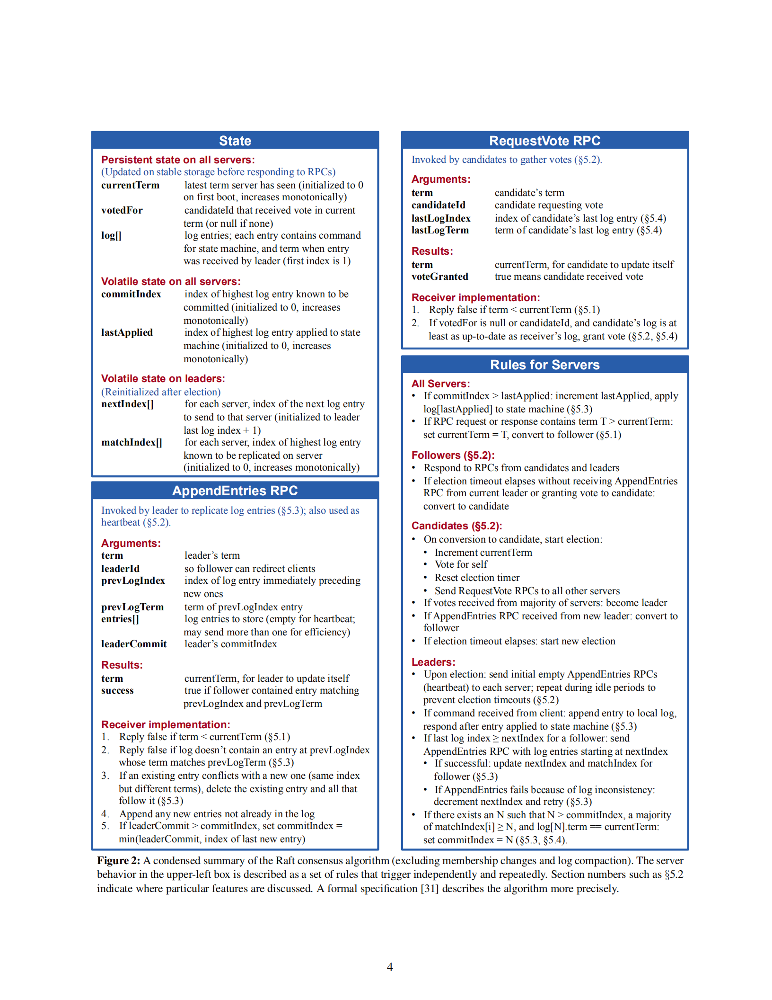

# Lab2b
需求：实现日志追加的部分。

需要在以下四个地方添加代码：
1. type Raft struct 
2. type RequestVoteArgs struct
3. func (rf *Raft) Start(command interface{}) (int, int, bool) 
4. Make(peers []*labrpc.ClientEnd, me int, persister *Persister, applyCh chan ApplyMsg)




## start
首先思考 start 函数的作用到底是什么？我要如何在心跳的基础上传送日志？

按照论文里的描述，当 AppendEntries 中不带有日志的时候，就是心跳；如果带有日志，就是日志追加。那带有日志的时候，这个 RPC 还具有心跳的功能吗？

经过思考之后， 我认为带有日志的 RPC 也可以被认为是心跳。

而通过 Start 函数的注释，不难理解其作用是在 master 节点上增加一条日志。

1. 若该节点不是 master, 则返回 false。（此时当然不应该添加日志）
2. 若该节点是 master, 则将输入的 command 写入日志。并返回这条日志应具有的 term 和 index。

> 问题：是否需要在 Start 函数里向从服务器发送 appendEntries PRC 呢？

答案应该是 No。在 master 的发送心跳的函数里，已经使用了一个计时器，定时发送心跳。而现在应该补充日志追加这一块的代码。
即检查自己的日志是否与节点的日志匹配，
如果不匹配则发送不匹配部分的日志，如果匹配，则发送心跳。
(这里的匹不匹配指的是 master 端维护的 matchIndex[] 数组。

如果从节点接受了这条日志，则将对应的 matchIndex++。如果超过半数的从节点（包括自己）都接受了这条日志，则这条日志被标记为 commit，即 commitIndex++。

lastApplied 与 commitIndex 之间可能会存在不一致，因为对于 master 来说，一条日志被 apply 后，还需要等待半数以上的节点同意，才能被标记为 commit。

> 问题：对于从节点，commitIndex 在何时更新呢？在收到来自 master 的新日志之后，马上就认为这条日志被 commit 吗？

不是的。看 AppendEntries RPC 的第 5 条规则：  If leaderCommit > commitIndex, set commitIndex = min(leaderCommit, index of last new entry)。
从节点的 commitIndex 是根据两者的较小值来决定的。

也就是说，如果想要在从节点上 commit 一条 log，至少需要 2 次 RPC。并且，master 的 commitIndex 经常会与从节点的 commitIndex 有延迟。


## 出现的问题

1. 日志 index 与测试需求不匹配：例如 TestBasicAgree2B 函数中的这一段

```go
for index := 1; index < iters+1; index++ {
    nd, _ := cfg.nCommitted(index)
    if nd > 0 {
        t.Fatalf("some have committed before Start()")
    }
    // todo: 此处有几率 fail, 这里一开始就没处理好
    xindex := cfg.one(index*100, servers, false)
    // todo: 此处原本是 xindex != index, 但我自己的实现与其 test 要求的全部相差了一个 1.
    if xindex+1 != index {
        t.Fatalf("got index %v but expected %v", xindex, index)
    }
}
```

2. commit 日志的时候，发生越界

```go
rf.mu.Lock()
*rf.ApplyM <- ApplyMsg{
    CommandValid: true,
    CommandIndex: int(rf.CommitIndex),
    Command:      rf.Logs[rf.CommitIndex].Command, // todo：此处会出现 rf.CommitIndex 越界的情况
}
rf.mu.Unlock()
```


3. 选举的时候，同一个服务器在同一个 term 内投了两个 candicate ，导致同时有两个 candidate 变成 leader。第一个 leader 收到了 command，但是第二个上任之后就把第一个变成了 follower，从而使得那个命令一直没被 commit

```go
time="2021-08-15T21:25:13+08:00" level=info msg="Failed to log to file, using default stderr"
time="2021-08-15T21:25:13+08:00" level=debug msg="0 没收到心跳QAQ"
time="2021-08-15T21:25:13+08:00" level=debug msg="id 0 开始选举,自己的任期为 1"
time="2021-08-15T21:25:13+08:00" level=trace msg="0给自己投了一票"
time="2021-08-15T21:25:13+08:00" level=debug msg="1 没收到心跳QAQ"
time="2021-08-15T21:25:13+08:00" level=debug msg="id 1 开始选举,自己的任期为 1"
time="2021-08-15T21:25:13+08:00" level=trace msg="0 向 2 发送了选举请求"
time="2021-08-15T21:25:13+08:00" level=trace msg="0 向 1 发送了选举请求"
time="2021-08-15T21:25:13+08:00" level=trace msg="1给自己投了一票"
time="2021-08-15T21:25:13+08:00" level=trace msg="1 向 0 发送了选举请求"
time="2021-08-15T21:25:13+08:00" level=trace msg="1 向 2 发送了选举请求"
time="2021-08-15T21:25:13+08:00" level=debug msg="2 没收到心跳QAQ"
Test (2B): basic agreement ...
time="2021-08-15T21:25:13+08:00" level=debug msg="id 2 开始选举,自己的任期为 1"
time="2021-08-15T21:25:13+08:00" level=trace msg="2给自己投了一票"
time="2021-08-15T21:25:13+08:00" level=trace msg="2 向 0 发送了选举请求"
time="2021-08-15T21:25:13+08:00" level=trace msg="1 收到了 0 的选举请求, 并且不同意"
time="2021-08-15T21:25:13+08:00" level=trace msg="0 收到了 1 的选举请求, 并且不同意"
time="2021-08-15T21:25:13+08:00" level=trace msg="2 向 1 发送了选举请求"
time="2021-08-15T21:25:13+08:00" level=trace msg="2 收到了 1 的选举请求, 并且不同意"
time="2021-08-15T21:25:13+08:00" level=trace msg="0 收到的选举回复, CurrentTerm:1, Agree? false"
time="2021-08-15T21:25:13+08:00" level=trace msg="1 收到的选举回复, CurrentTerm:1, Agree? false"
time="2021-08-15T21:25:13+08:00" level=trace msg="1 收到的选举回复, CurrentTerm:1, Agree? false"
time="2021-08-15T21:25:13+08:00" level=trace msg="2 收到了 0 的选举请求, 同意"
time="2021-08-15T21:25:13+08:00" level=trace msg="1 收到了 2 的选举请求, 同意"
time="2021-08-15T21:25:13+08:00" level=trace msg="0 收到了 2 的选举请求, 同意"
time="2021-08-15T21:25:13+08:00" level=trace msg="0 收到的选举回复, CurrentTerm:1, Agree? true"
time="2021-08-15T21:25:13+08:00" level=trace msg="2 收到的选举回复, CurrentTerm:1, Agree? true"
time="2021-08-15T21:25:13+08:00" level=trace msg="2 收到的选举回复, CurrentTerm:1, Agree? true"
time="2021-08-15T21:25:13+08:00" level=debug msg="id 0获得选票2张，总共有3人"
time="2021-08-15T21:25:13+08:00" level=debug msg="id 0 发送心跳"
time="2021-08-15T21:25:13+08:00" level=debug msg="id 1获得选票1张，总共有3人"
time="2021-08-15T21:25:13+08:00" level=error msg="0 收到 command, 本地 log: [{1 100}]"
time="2021-08-15T21:25:13+08:00" level=debug msg="id 2获得选票3张，总共有3人"
time="2021-08-15T21:25:13+08:00" level=trace msg="1 收到 id 0的心跳请求，其任期为 1 自己的任期为 1"
time="2021-08-15T21:25:13+08:00" level=trace msg="2 收到 id 0的心跳请求，其任期为 1 自己的任期为 1"
time="2021-08-15T21:25:13+08:00" level=debug msg="id 2 发送心跳"
time="2021-08-15T21:25:13+08:00" level=trace msg="0 收到 id 2的心跳请求，其任期为 1 自己的任期为 1"
time="2021-08-15T21:25:13+08:00" level=trace msg="1 收到 id 2的心跳请求，其任期为 1 自己的任期为 1"
time="2021-08-15T21:25:13+08:00" level=debug msg="2 没收到心跳QAQ"
time="2021-08-15T21:25:13+08:00" level=debug msg="1 没收到心跳QAQ"
time="2021-08-15T21:25:13+08:00" level=debug msg="0 没收到心跳QAQ"
time="2021-08-15T21:25:13+08:00" level=debug msg="id 2 开始选举,自己的任期为 2"
time="2021-08-15T21:25:13+08:00" level=trace msg="2给自己投了一票"
time="2021-08-15T21:25:13+08:00" level=trace msg="2 向 0 发送了选举请求"
time="2021-08-15T21:25:13+08:00" level=trace msg="2 向 1 发送了选举请求"
time="2021-08-15T21:25:13+08:00" level=trace msg="0 收到了 2 的选举请求, 并且不同意"
time="2021-08-15T21:25:13+08:00" level=trace msg="1 收到了 2 的选举请求, 同意"
time="2021-08-15T21:25:13+08:00" level=trace msg="2 收到的选举回复, CurrentTerm:2, Agree? false"
time="2021-08-15T21:25:13+08:00" level=trace msg="2 收到的选举回复, CurrentTerm:2, Agree? true"
time="2021-08-15T21:25:13+08:00" level=debug msg="id 2获得选票2张，总共有3人"
time="2021-08-15T21:25:13+08:00" level=debug msg="id 2 发送心跳"
time="2021-08-15T21:25:13+08:00" level=trace msg="0 收到 id 2的心跳请求，其任期为 2 自己的任期为 1"
time="2021-08-15T21:25:13+08:00" level=trace msg="1 收到 id 2的心跳请求，其任期为 2 自己的任期为 2"
time="2021-08-15T21:25:13+08:00" level=debug msg="id 2 发送心跳"
time="2021-08-15T21:25:13+08:00" level=trace msg="0 收到 id 2的心跳请求，其任期为 2 自己的任期为 2"
time="2021-08-15T21:25:13+08:00" level=trace msg="1 收到 id 2的心跳请求，其任期为 2 自己的任期为 2"
time="2021-08-15T21:25:13+08:00" level=debug msg="id 2 发送心跳"
time="2021-08-15T21:25:13+08:00" level=trace msg="0 收到 id 2的心跳请求，其任期为 2 自己的任期为 2"
time="2021-08-15T21:25:13+08:00" level=trace msg="1 收到 id 2的心跳请求，其任期为 2 自己的任期为 2"
time="2021-08-15T21:25:14+08:00" level=debug msg="id 2 发送心跳"
time="2021-08-15T21:25:14+08:00" level=trace msg="0 收到 id 2的心跳请求，其任期为 2 自己的任期为 2"
time="2021-08-15T21:25:14+08:00" level=trace msg="1 收到 id 2的心跳请求，其任期为 2 自己的任期为 2"
time="2021-08-15T21:25:14+08:00" level=debug msg="id 2 发送心跳"
time="2021-08-15T21:25:14+08:00" level=trace msg="0 收到 id 2的心跳请求，其任期为 2 自己的任期为 2"
time="2021-08-15T21:25:14+08:00" level=trace msg="1 收到 id 2的心跳请求，其任期为 2 自己的任期为 2"
time="2021-08-15T21:25:14+08:00" level=debug msg="id 2 发送心跳"
time="2021-08-15T21:25:14+08:00" level=trace msg="1 收到 id 2的心跳请求，其任期为 2 自己的任期为 2"
time="2021-08-15T21:25:14+08:00" level=trace msg="0 收到 id 2的心跳请求，其任期为 2 自己的任期为 2"
time="2021-08-15T21:25:14+08:00" level=debug msg="id 2 发送心跳"
time="2021-08-15T21:25:14+08:00" level=trace msg="0 收到 id 2的心跳请求，其任期为 2 自己的任期为 2"
time="2021-08-15T21:25:14+08:00" level=trace msg="1 收到 id 2的心跳请求，其任期为 2 自己的任期为 2"
time="2021-08-15T21:25:14+08:00" level=debug msg="id 2 发送心跳"
time="2021-08-15T21:25:14+08:00" level=trace msg="0 收到 id 2的心跳请求，其任期为 2 自己的任期为 2"
time="2021-08-15T21:25:14+08:00" level=trace msg="1 收到 id 2的心跳请求，其任期为 2 自己的任期为 2"
time="2021-08-15T21:25:14+08:00" level=debug msg="id 2 发送心跳"
time="2021-08-15T21:25:14+08:00" level=trace msg="0 收到 id 2的心跳请求，其任期为 2 自己的任期为 2"
time="2021-08-15T21:25:14+08:00" level=trace msg="1 收到 id 2的心跳请求，其任期为 2 自己的任期为 2"
time="2021-08-15T21:25:14+08:00" level=debug msg="id 2 发送心跳"
time="2021-08-15T21:25:14+08:00" level=trace msg="0 收到 id 2的心跳请求，其任期为 2 自己的任期为 2"
time="2021-08-15T21:25:14+08:00" level=trace msg="1 收到 id 2的心跳请求，其任期为 2 自己的任期为 2"
time="2021-08-15T21:25:14+08:00" level=debug msg="id 2 发送心跳"
time="2021-08-15T21:25:14+08:00" level=trace msg="0 收到 id 2的心跳请求，其任期为 2 自己的任期为 2"
time="2021-08-15T21:25:14+08:00" level=trace msg="1 收到 id 2的心跳请求，其任期为 2 自己的任期为 2"
time="2021-08-15T21:25:14+08:00" level=debug msg="id 2 发送心跳"
time="2021-08-15T21:25:14+08:00" level=trace msg="0 收到 id 2的心跳请求，其任期为 2 自己的任期为 2"
time="2021-08-15T21:25:14+08:00" level=trace msg="1 收到 id 2的心跳请求，其任期为 2 自己的任期为 2"
time="2021-08-15T21:25:14+08:00" level=debug msg="id 2 发送心跳"
time="2021-08-15T21:25:14+08:00" level=trace msg="0 收到 id 2的心跳请求，其任期为 2 自己的任期为 2"
time="2021-08-15T21:25:14+08:00" level=trace msg="1 收到 id 2的心跳请求，其任期为 2 自己的任期为 2"
time="2021-08-15T21:25:15+08:00" level=debug msg="id 2 发送心跳"
time="2021-08-15T21:25:15+08:00" level=trace msg="1 收到 id 2的心跳请求，其任期为 2 自己的任期为 2"
time="2021-08-15T21:25:15+08:00" level=trace msg="0 收到 id 2的心跳请求，其任期为 2 自己的任期为 2"
time="2021-08-15T21:25:15+08:00" level=debug msg="id 2 发送心跳"
time="2021-08-15T21:25:15+08:00" level=trace msg="1 收到 id 2的心跳请求，其任期为 2 自己的任期为 2"
time="2021-08-15T21:25:15+08:00" level=trace msg="0 收到 id 2的心跳请求，其任期为 2 自己的任期为 2"
time="2021-08-15T21:25:15+08:00" level=debug msg="id 2 发送心跳"
time="2021-08-15T21:25:15+08:00" level=trace msg="0 收到 id 2的心跳请求，其任期为 2 自己的任期为 2"
time="2021-08-15T21:25:15+08:00" level=trace msg="1 收到 id 2的心跳请求，其任期为 2 自己的任期为 2"
time="2021-08-15T21:25:15+08:00" level=debug msg="id 2 发送心跳"
time="2021-08-15T21:25:15+08:00" level=trace msg="0 收到 id 2的心跳请求，其任期为 2 自己的任期为 2"
time="2021-08-15T21:25:15+08:00" level=trace msg="1 收到 id 2的心跳请求，其任期为 2 自己的任期为 2"
position  0 has committed  0 logs:  <nil> 正确的log是： 100 希望有  3  个服务器 commit
--- FAIL: TestBasicAgree2B (2.11s)
config.go:470: one(100) failed to reach agreement
FAIL
exit status 1
FAIL	_/home/lincyaw/Documents/6.824/src/raft	2.130s
```

4. 一些报错

```go
time="2021-08-15T21:27:32+08:00" level=info msg="Failed to log to file, using default stderr"
time="2021-08-15T21:27:32+08:00" level=debug msg="0 没收到心跳QAQ"
time="2021-08-15T21:27:32+08:00" level=debug msg="id 0 开始选举,自己的任期为 1"
time="2021-08-15T21:27:32+08:00" level=trace msg="0给自己投了一票"
time="2021-08-15T21:27:32+08:00" level=trace msg="0 向 1 发送了选举请求"
time="2021-08-15T21:27:32+08:00" level=trace msg="0 向 2 发送了选举请求"
time="2021-08-15T21:27:32+08:00" level=debug msg="1 没收到心跳QAQ"
time="2021-08-15T21:27:32+08:00" level=debug msg="id 1 开始选举,自己的任期为 1"
time="2021-08-15T21:27:32+08:00" level=trace msg="1给自己投了一票"
time="2021-08-15T21:27:32+08:00" level=trace msg="1 向 0 发送了选举请求"
time="2021-08-15T21:27:32+08:00" level=trace msg="1 向 2 发送了选举请求"
Test (2B): basic agreement ...
time="2021-08-15T21:27:32+08:00" level=debug msg="2 没收到心跳QAQ"
time="2021-08-15T21:27:32+08:00" level=debug msg="id 2 开始选举,自己的任期为 1"
time="2021-08-15T21:27:32+08:00" level=trace msg="2给自己投了一票"
time="2021-08-15T21:27:32+08:00" level=trace msg="2 向 1 发送了选举请求"
time="2021-08-15T21:27:32+08:00" level=debug msg="2 没收到心跳QAQ"
time="2021-08-15T21:27:32+08:00" level=trace msg="2 收到了 1 的选举请求, 并且不同意"
time="2021-08-15T21:27:32+08:00" level=trace msg="2 向 0 发送了选举请求"
time="2021-08-15T21:27:32+08:00" level=trace msg="2 收到了 0 的选举请求, 同意"
time="2021-08-15T21:27:32+08:00" level=trace msg="1 收到的选举回复, CurrentTerm:1, Agree? false"
time="2021-08-15T21:27:32+08:00" level=trace msg="1 收到了 0 的选举请求, 并且不同意"
time="2021-08-15T21:27:32+08:00" level=trace msg="0 收到了 2 的选举请求, 并且不同意"
time="2021-08-15T21:27:32+08:00" level=trace msg="1 收到了 2 的选举请求, 同意"
time="2021-08-15T21:27:32+08:00" level=trace msg="0 收到了 1 的选举请求, 同意"
time="2021-08-15T21:27:32+08:00" level=trace msg="0 收到的选举回复, CurrentTerm:1, Agree? false"
time="2021-08-15T21:27:32+08:00" level=trace msg="2 收到的选举回复, CurrentTerm:1, Agree? false"
time="2021-08-15T21:27:32+08:00" level=trace msg="0 收到的选举回复, CurrentTerm:1, Agree? true"
time="2021-08-15T21:27:32+08:00" level=trace msg="2 收到的选举回复, CurrentTerm:1, Agree? true"
time="2021-08-15T21:27:32+08:00" level=trace msg="1 收到的选举回复, CurrentTerm:1, Agree? true"
time="2021-08-15T21:27:32+08:00" level=debug msg="id 0获得选票2张，总共有3人"
time="2021-08-15T21:27:32+08:00" level=debug msg="id 0 发送心跳"
time="2021-08-15T21:27:32+08:00" level=error msg="0 收到 command, 本地 log: [{1 100}]"
time="2021-08-15T21:27:32+08:00" level=debug msg="id 1获得选票2张，总共有3人"
time="2021-08-15T21:27:32+08:00" level=error msg="rf.MatchIndex[idx]: 0 term: 1, 0向1心跳附加0"
time="2021-08-15T21:27:32+08:00" level=debug msg="id 1 发送心跳"
time="2021-08-15T21:27:32+08:00" level=error msg="rf.MatchIndex[idx]: 0 term: 1, 0向2心跳附加0"
time="2021-08-15T21:27:32+08:00" level=debug msg="id 2获得选票2张，总共有3人"
time="2021-08-15T21:27:32+08:00" level=debug msg="id 2 发送心跳"
time="2021-08-15T21:27:32+08:00" level=trace msg="0 收到 id 1的心跳请求，其任期为 1 自己的任期为 1"
time="2021-08-15T21:27:32+08:00" level=trace msg="2 收到 id 1的心跳请求，其任期为 1 自己的任期为 1"
time="2021-08-15T21:27:32+08:00" level=trace msg="1 收到 id 0的心跳请求，其任期为 1 自己的任期为 1"
time="2021-08-15T21:27:32+08:00" level=error msg="1 接受日志，本地日志为:[{1 100}]"
time="2021-08-15T21:27:32+08:00" level=error msg="1 已经成功 commit 0"
time="2021-08-15T21:27:32+08:00" level=trace msg="1 收到 id 2的心跳请求，其任期为 1 自己的任期为 1"
time="2021-08-15T21:27:32+08:00" level=trace msg="0 收到 id 2的心跳请求，其任期为 1 自己的任期为 1"
time="2021-08-15T21:27:32+08:00" level=trace msg="2 收到 id 0的心跳请求，其任期为 1 自己的任期为 1"
time="2021-08-15T21:27:32+08:00" level=error msg="2 接受日志，本地日志为:[{1 100}]"
time="2021-08-15T21:27:32+08:00" level=error msg="2 已经成功 commit 0"
time="2021-08-15T21:27:32+08:00" level=error msg="服务器 1 的匹配上的目录是0"
time="2021-08-15T21:27:32+08:00" level=error msg="服务器 2 的匹配上的目录是0"
time="2021-08-15T21:27:32+08:00" level=error msg="0 提交日志 "
time="2021-08-15T21:27:32+08:00" level=debug msg="2 没收到心跳QAQ"
time="2021-08-15T21:27:32+08:00" level=debug msg="1 没收到心跳QAQ"
time="2021-08-15T21:27:32+08:00" level=debug msg="0 没收到心跳QAQ"
time="2021-08-15T21:27:32+08:00" level=debug msg="id 0 开始选举,自己的任期为 2"
time="2021-08-15T21:27:32+08:00" level=trace msg="0给自己投了一票"
time="2021-08-15T21:27:32+08:00" level=trace msg="0 向 1 发送了选举请求"
time="2021-08-15T21:27:32+08:00" level=trace msg="0 向 2 发送了选举请求"
time="2021-08-15T21:27:32+08:00" level=trace msg="1 收到了 0 的选举请求, 并且不同意"
time="2021-08-15T21:27:32+08:00" level=trace msg="2 收到了 0 的选举请求, 同意"
time="2021-08-15T21:27:32+08:00" level=trace msg="0 收到的选举回复, CurrentTerm:2, Agree? false"
time="2021-08-15T21:27:32+08:00" level=trace msg="0 收到的选举回复, CurrentTerm:2, Agree? true"
time="2021-08-15T21:27:33+08:00" level=debug msg="id 0获得选票2张，总共有3人"
time="2021-08-15T21:27:33+08:00" level=debug msg="id 0 发送心跳"
time="2021-08-15T21:27:33+08:00" level=error msg="rf.MatchIndex[idx]: 0 term: 1, 0向1心跳附加0"
time="2021-08-15T21:27:33+08:00" level=error msg="rf.MatchIndex[idx]: 0 term: 1, 0向2心跳附加0"
time="2021-08-15T21:27:33+08:00" level=trace msg="1 收到 id 0的心跳请求，其任期为 2 自己的任期为 1"
time="2021-08-15T21:27:33+08:00" level=trace msg="2 收到 id 0的心跳请求，其任期为 2 自己的任期为 2"
time="2021-08-15T21:27:33+08:00" level=error msg="1 接受日志，本地日志为:[{1 100} {1 100}]"
time="2021-08-15T21:27:33+08:00" level=error msg="2 接受日志，本地日志为:[{1 100} {1 100}]"
time="2021-08-15T21:27:33+08:00" level=error msg="1 已经成功 commit 1"
time="2021-08-15T21:27:33+08:00" level=error msg="2 已经成功 commit 1"
time="2021-08-15T21:27:33+08:00" level=error msg="服务器 1 的匹配上的目录是1"
time="2021-08-15T21:27:33+08:00" level=error msg="服务器 2 的匹配上的目录是1"
time="2021-08-15T21:27:33+08:00" level=error msg="0 提交日志 "
panic: runtime error: index out of range [1] with length 1

goroutine 25 [running]:
_/home/lincyaw/Documents/6.824/src/raft.(*Raft).sendHearBeatsClock(0xc0000ec1c0, 0x735658, 0xc000091a80)
	/home/lincyaw/Documents/6.824/src/raft/raft.go:774 +0xcf2
created by _/home/lincyaw/Documents/6.824/src/raft.Make
	/home/lincyaw/Documents/6.824/src/raft/raft.go:538 +0x72a
exit status 2
FAIL	_/home/lincyaw/Documents/6.824/src/raft	0.565s
```